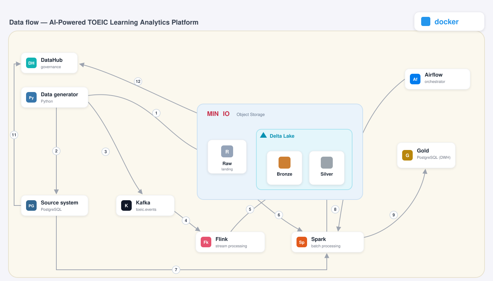
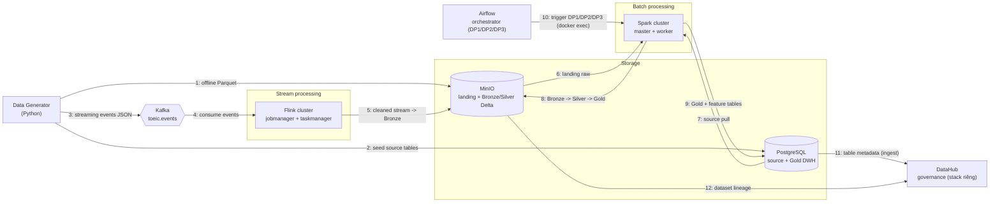

# System Architecture — Deployment Diagram

Sơ đồ triển khai chi tiết của AI-Powered TOEIC Learning Analytics Platform. Mỗi node là một
**deployable unit** (service chạy được bằng Docker); mũi tên đi theo **luồng dữ liệu**, có đánh số +
mô tả.

---

## 1. Deployment diagram (data flow)



<details>
<summary>Bản text (Mermaid)</summary>



</details>

### Mô tả luồng dữ liệu

| # | Luồng | Ý nghĩa |
|---|-------|---------|
| 1 | Generator → MinIO | Parquet offline (7 bảng) vào bucket `landing` |
| 2 | Generator → Postgres | seed `src_users`, `src_questions` (mô phỏng DB department khác) |
| 3 | Generator → Kafka | event streaming JSON (burst/late/duplicate) |
| 4 | Kafka → Flink | Flink consume `toeic.events` |
| 5 | Flink → MinIO | stream đã xử lý (windowing/watermark/dedup) → Bronze `stream_events` |
| 6 | MinIO → Spark | Spark đọc landing raw (DP1) |
| 7 | Postgres → Spark | Spark pull source DB (ingest đa nguồn) |
| 8 | Spark → MinIO | Bronze → Silver → Gold (Delta) (DP1, DP2) |
| 9 | Spark → Postgres | Gold (dim/fact/obt) + feature (DP2, DP3) |
| 10 | Airflow → Spark | orchestrate 3 pipeline (ingest + validate) qua docker exec |
| 11–12 | Postgres/MinIO → DataHub | ingest metadata + lineage (governance) |

---

## 2. Zone dữ liệu (medallion)

```
Source (MinIO landing + Postgres) → Bronze (raw_) → Silver (stg_) → Gold (dim_/fact_/obt_/feat_)
```
- **Bronze/Silver** = Delta Lake trên MinIO. **Gold** = PostgreSQL (BI + ML).
- Chi tiết schema: [schema_design.md](schema_design.md).

## 3. Ba data pipeline (Airflow)

| Pipeline | Luồng | Stage |
|----------|-------|-------|
| **DP1** | landing → Bronze | ingest → validate |
| **DP2** | Bronze → Silver → Gold | ingest (silver→gold_dim→gold_fact) → validate |
| **DP3** | feature offline `feat_user_90d` (point-in-time) | ingest → validate |

Chi tiết: [orchestration.md](orchestration.md).

## 4. Developer flow (khác data flow)

```
dev viết code -> git commit -> docker compose build/up -> chạy job (Spark/Flink) + Airflow DAG
```
- Dev đẩy code, dùng `docker compose up` dựng toàn bộ stack local.
- **DataHub chạy stack Docker RIÊNG** (không trong `docker-compose.yml`) — đúng chuẩn production
  (governance là platform cross-cutting). Xem [governance.md](governance.md).

## 5. Deployable units (tổng hợp)

| Unit | Vai trò | Cổng chính |
|------|---------|-----------|
| MinIO | object storage (landing + Bronze/Silver Delta) | 9000/9001 |
| PostgreSQL | source DB + Gold warehouse | 5433 |
| Kafka (KRaft) | broker streaming `toeic.events` | 9092 |
| Spark (master+worker) | batch processing | 8080/8081 |
| Flink (jobmanager+taskmanager) | stream processing | 8082 |
| Airflow | orchestration DP1/DP2/DP3 | 8083 |
| DataHub (stack riêng) | governance: lineage + contract | 9002 |
