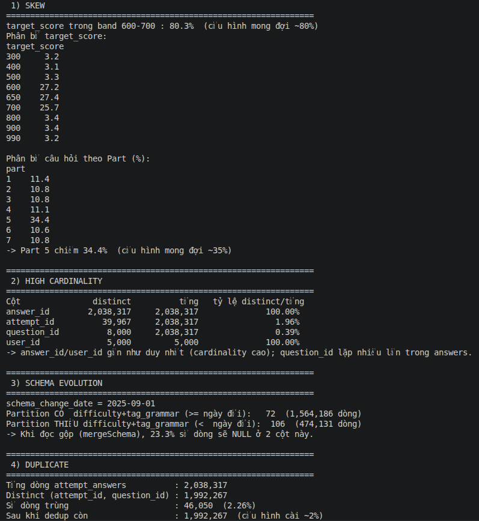
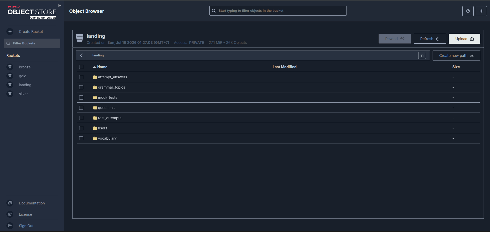
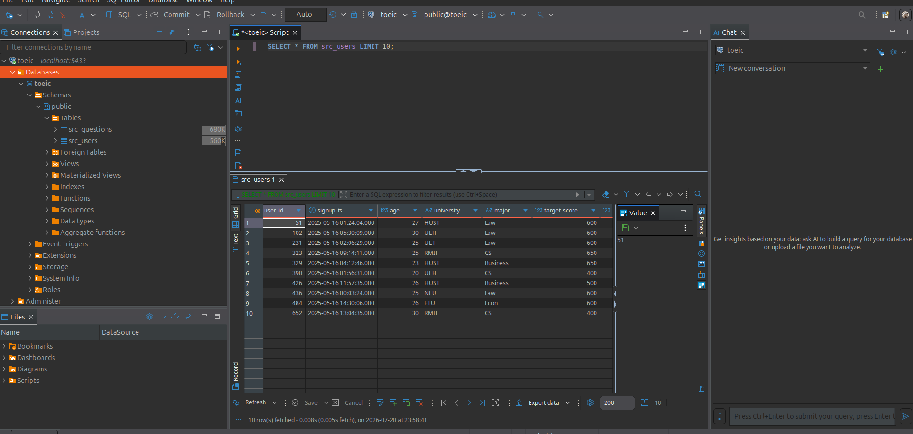

# Data Generator — Offline (Section 01)

Tài liệu mô tả **offline data generator** sinh dữ liệu luyện thi TOEIC dạng Parquet,
có **cố tình cài 4 lỗi dữ liệu** để các phase Spark xử lý.

## 1. Tổng quan
- Code: [`generator/offline_generator.py`](../generator/offline_generator.py)
- Cấu hình: [`generator/config.yaml`](../generator/config.yaml) — mọi tham số ở đây, không hardcode.
- Reproducible: `random_seed = 42` → chạy lại ra kết quả y hệt.
- Chạy: `uv run python generator/offline_generator.py`
- Đầu ra: `data/offline/` (Parquet, partition theo ngày) — chưa đẩy lên MinIO (việc của Phase 3).

## 2. Bảy bảng sinh ra

| Bảng | Grain | Partition |
|------|-------|-----------|
| `users` | 1 dòng / học viên | `signup_date` |
| `questions` | 1 dòng / câu hỏi | — |
| `vocabulary` | 1 dòng / từ | — |
| `grammar_topics` | 1 dòng / chủ đề | — |
| `mock_tests` | 1 dòng / bộ đề | — |
| `test_attempts` | 1 dòng / lượt thi | — |
| `attempt_answers` | 1 dòng / câu trả lời | `attempt_date` |

Cơ chế sinh điểm: `P(đúng) = sigmoid(base_ability − difficulty + noise)`, `base_ability`
tăng dần theo thời gian → tạo tín hiệu học tập.

## 3. Bốn lỗi cố tình cài + bằng chứng đo được

Chạy `uv run python generator/quality_report.py` để đo. Kết quả (seed=42):

### 3.1 Skew
- `target_score` trong band 600–700: **80.3%** (cấu hình ~80%).
- Câu hỏi thuộc **Part 5: 34.4%** (cấu hình ~35%), các part khác ~10–11%.

### 3.2 High cardinality
| Cột | distinct | tổng | tỷ lệ |
|-----|---------:|-----:|------:|
| answer_id | 2,038,317 | 2,038,317 | 100.00% |
| attempt_id | 39,967 | 2,038,317 | 1.96% |
| question_id | 8,000 | 2,038,317 | 0.39% |
| user_id | 5,000 | 5,000 | 100.00% |

`answer_id`/`user_id` gần như duy nhất → cardinality cao (gây nặng shuffle/join ở Spark).

### 3.3 Schema evolution
- `schema_change_date = 2025-09-01`.
- **72 partition** (sau ngày đổi) **có** `difficulty` + `tag_grammar` (1,564,186 dòng).
- **106 partition** (trước ngày đổi) **thiếu** 2 cột đó (474,131 dòng).
- Khi đọc gộp bằng `mergeSchema`, **23.3%** số dòng sẽ NULL ở 2 cột này.

### 3.4 Duplicate
- Tổng dòng: 2,038,317; distinct `(attempt_id, question_id)`: 1,992,267.
- **Số dòng trùng: 46,050 (2.26%)** — gồm ~2% cố tình cài + một ít trùng tự nhiên do lấy mẫu câu có lặp.
- **Dedup key** (dùng ở Silver, Phase 6): `(attempt_id, question_id)`.

## 4. Ảnh chụp bằng chứng

*Kết quả `quality_report.py` — đo 4 lỗi cố tình cài trên dữ liệu offline.*

## 5. Lưu trữ để ingest sau (store → Bronze)

Sau khi sinh, dữ liệu được **đẩy lên nơi lưu trữ** để các pipeline ingest vào Bronze về sau
(bằng [`upload_to_landing.py`](../generator/upload_to_landing.py)) — mô phỏng data **đang nằm ở
department/hệ thống khác**:

- **MinIO** (object storage, bucket `landing`): các bảng Parquet offline (nguồn cho **DP1 → Bronze**).
- **PostgreSQL** (`src_users`, `src_questions`): seed thẳng vào DB nguồn (mô phỏng OLTP department khác,
  nguồn pull đa nguồn cho Spark).

*Bucket `landing` trên MinIO — Parquet offline đã sẵn sàng cho DP1 ingest vào Bronze.*

*Bảng nguồn trên PostgreSQL (xem qua DBeaver) — mô phỏng dữ liệu ở hệ thống department khác.*
