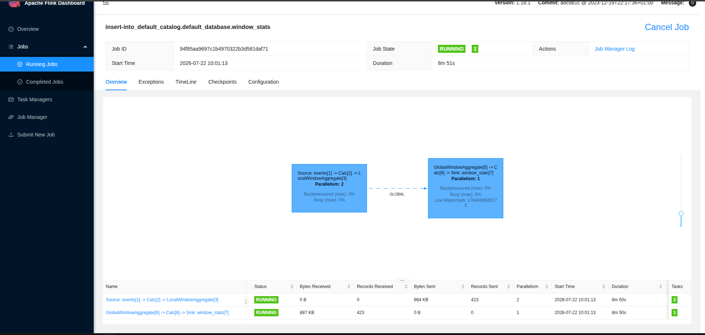
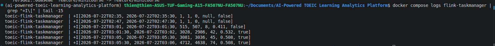
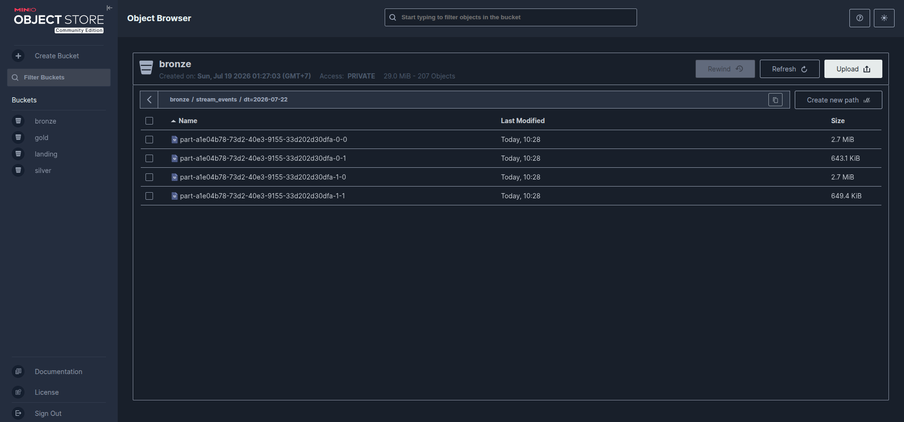

# Flink Streaming — xử lý lỗi streaming (Phase 7)

Xử lý luồng sự kiện học viên real-time: **Kafka → Flink → Bronze**.

```
stream_generator.py ──event JSON──► Kafka (toeic.events) ──► Flink ──► Bronze (MinIO)
   (Producer)         burst/late/dup         3 partition      windowing    stream_events/
```

- Generator: [`generator/stream_generator.py`](../generator/stream_generator.py)
- Flink windowing: [`processing/flink/flink_stream.py`](../processing/flink/flink_stream.py)
- Flink → Bronze: [`processing/flink/flink_to_bronze.py`](../processing/flink/flink_to_bronze.py)

---

## 1. Data Generator streaming

Mỗi event có **2 mốc thời gian**: `event_timestamp` (lúc sự kiện xảy ra) vs `created_ts` (lúc
bản ghi được tạo/gửi). Cố tình cài **3 lỗi streaming**:

| Lỗi | Cách cài | Tham số |
|-----|----------|---------|
| **Burst** | xen kẽ khung tốc độ cao (5s burst mỗi 20s) — mô phỏng spike 19-22h | `--burst-eps` |
| **Late arrival / out-of-order** | ~12% event có `event_timestamp` sớm hơn `created_ts` 1-30 phút | `late_arrival_rate` |
| **Duplicate** | ~1.5% event gửi lại cùng `event_id` | `duplicate_rate_stream` |

Chạy: `uv run python generator/stream_generator.py --events 5000`

---

## 2. Flink processing — event-time + watermark + windowing + dedup

### Source: Kafka + event-time + watermark
Khai báo `event_timestamp` là **event-time attribute** và **watermark** trễ 5 giây (chịu được
out-of-order tới 5s; muộn hơn bị coi là late):

```sql
CREATE TABLE events (
    event_id STRING, event_type STRING,
    event_timestamp TIMESTAMP(3), created_ts TIMESTAMP(3),
    user_id INT, question_id INT, part INT, is_correct BOOLEAN,
    WATERMARK FOR event_timestamp AS event_timestamp - INTERVAL '5' SECOND
) WITH ('connector'='kafka', 'topic'='toeic.events',
        'properties.bootstrap.servers'='kafka:29092', 'format'='json', ...)
```

### Windowing (rubric: capture đoạn code window)
**TUMBLE 30s** trên event-time, tính `f_correct_rate` (đại diện `f_correct_rate_60m`), đếm event,
phát hiện duplicate (`n_events` vs `COUNT(DISTINCT event_id)`), và cờ burst:

```sql
INSERT INTO window_stats
SELECT
    window_start, window_end,
    COUNT(*)                            AS n_events,
    COUNT(DISTINCT event_id)            AS n_unique_events,
    COUNT(*) - COUNT(DISTINCT event_id) AS n_duplicate,
    ROUND(SUM(CASE WHEN event_type='question_answered' AND is_correct THEN 1 ELSE 0 END) * 1.0
          / NULLIF(SUM(CASE WHEN event_type='question_answered' THEN 1 ELSE 0 END), 0), 3) AS f_correct_rate,
    COUNT(*) > 1500                     AS f_burst_flag
FROM TABLE(TUMBLE(TABLE events, DESCRIPTOR(event_timestamp), INTERVAL '30' SECOND))
GROUP BY window_start, window_end
```

### Xử lý 3 lỗi — bằng chứng

| Lỗi | Xử lý | Bằng chứng |
|-----|-------|-----------|
| **Late/out-of-order** | event-time + watermark (event muộn quá watermark bị loại; event lệch được xếp đúng window event-time) | Flink UI: **Low Watermark** advancing |
| **Duplicate** | so `n_events` vs `n_unique_events` trong window | cột **n_duplicate** = 8/42/45/74 |
| **Burst** | cờ `f_burst_flag` khi window vượt ngưỡng; parallelism 2 để bắt kịp | window đông → **f_burst_flag=true**, Flink UI backpressure 0% |

Kết quả window (print sink):
```
+I[03:01,    03:01:30,  515,  507,  8,  0.411, false]
+I[03:01:30, 03:02,    3028, 2986, 42,  0.532, true ]
+I[03:05:30, 03:06,    4712, 4638, 74,  0.508, true ]
```


*Flink UI: job Source(P2) → Window → Sink, RUNNING, Low Watermark (event-time), backpressure 0%.*


*Kết quả window: n_events / n_unique / n_duplicate / f_correct_rate / f_burst_flag.*

---

## 3. Ghi stream RAW vào Bronze (MinIO)

Job [`flink_to_bronze.py`](../processing/flink/flink_to_bronze.py) đọc Kafka → ghi **RAW**
(append-only, giữ nguyên lỗi kể cả duplicate) ra `s3a://bronze/stream_events/` (JSON, partition
theo ngày `dt`). File được finalize qua **checkpoint** (30s).

> **Kiến trúc:** Bronze = raw nên KHÔNG dedup khi ghi (giống offline: Bronze giữ dup, Silver mới
> dedup). Dedup đã được **demo** ở phần windowing (đếm `n_duplicate`).


*MinIO: bronze/stream_events/dt=2026-07-22/ — file part-* raw event, partition theo ngày.*

---

## 4. Hạ tầng

| Service | Vai trò | Port |
|---------|---------|------|
| Kafka (KRaft) | message broker topic `toeic.events` | 9092 |
| Flink jobmanager | điều phối + Flink UI | 8082 |
| Flink taskmanager | thực thi (2 slots) | — |

Submit Flink job: `docker compose exec flink-jobmanager flink run -d -py /opt/flink/jobs/<job>.py`
