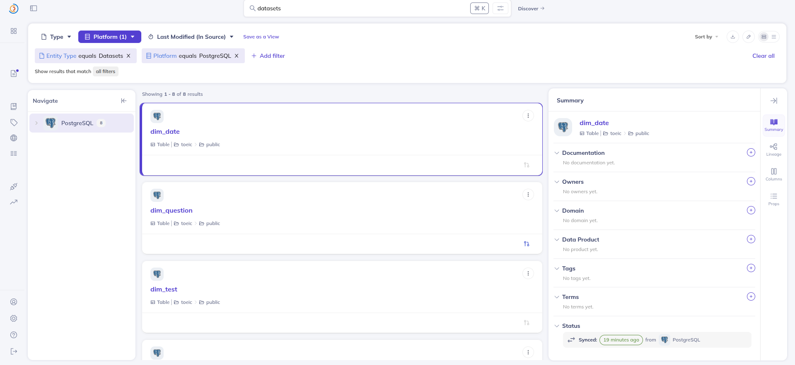
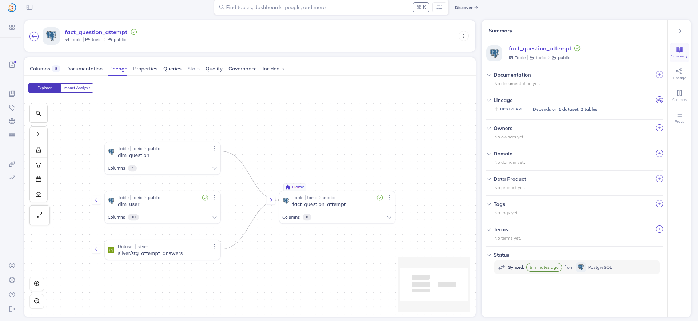
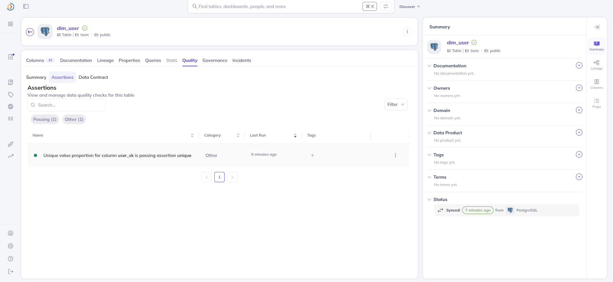

# Data Governance — DataHub (Phase 10)

Governance cho lakehouse TOEIC bằng **DataHub**: metadata catalog + **lineage** (dữ liệu chảy từ
đâu đến đâu) + **data contract** (assertion chất lượng).

- DataHub UI: `http://localhost:9002` (login `datahub`/`datahub`), GMS: `http://localhost:8085`
- Recipe/script: [`governance/datahub/`](../governance/datahub/)
- DataHub chạy **stack docker RIÊNG**, song song main stack — đúng chuẩn production (governance là
  platform cross-cutting, tách khỏi cụm pipeline).

---

## 1. Triển khai DataHub (bypass quickstart)

**Vấn đề:** `datahub docker quickstart` KHÔNG chạy được ở môi trường này — Docker Compose là **v5.x**
(quá mới) so với thứ quickstart CLI hỗ trợ (v2.x): CLI mới tự sinh compose có bug broker DNS, CLI cũ
không nhận ra compose v5.x. Không liên quan RAM/pipeline.

**Cách chạy được:** bypass CLI — chạy **compose CHÍNH THỨC v1.4.0.3 trực tiếp** bằng `docker compose`
v2, với các fix: kafka-setup dùng tag `:head` (bản version không publish), Confluent 7.9.2 (còn
zookeeper), Elasticsearch 7.10.1 (không OpenSearch), remap port GMS 8085 / broker 9095 / schema 8086
(tránh spark-master 8080 / kafka 9092 / spark-worker 8081). Script: [`governance/datahub/start_datahub.sh`](../governance/datahub/start_datahub.sh).

> Bài học: DataHub quickstart rất kén môi trường; deploy production chuẩn dùng Kubernetes + Helm.

## 2. Ingest metadata (Postgres Gold → DataHub)

Recipe [`postgres_gold_recipe.yml`](../governance/datahub/postgres_gold_recipe.yml) crawl **8 bảng
Gold** (`dim_*`, `fact_*`, `obt_*`, `feat_*`) từ Postgres → DataHub. Kết quả: 8 dataset với schema
đầy đủ (vd `dim_user` thấy rõ cột SCD2 `valid_from_ts`/`valid_to_ts`/`is_current`).


*8 bảng Gold trong DataHub (platform PostgreSQL).*

## 3. Lineage (Source → Bronze → Silver → Gold → Feature)

Định nghĩa lineage trong [`lineage.yml`](../governance/datahub/lineage.yml), ingest qua source
`datahub-lineage-file`. Thể hiện luồng pipeline thật, cross-platform (MinIO/s3 → PostgreSQL):

```
landing/* (s3) → bronze/raw_* (s3) → silver/stg_* (s3) → dim_*/fact_* (postgres) → feat_user_90d
```


*Lineage `fact_question_attempt`: gộp từ silver/stg_attempt_answers + dim_user + dim_question.*

## 4. Data contract (assertions)

Emit assertion qua DataHub SDK ([`emit_assertion.py`](../governance/datahub/emit_assertion.py)) —
khớp với các check ở `validate_gold.py`:

| Assertion | Dataset | Ý nghĩa |
|-----------|---------|---------|
| `user_sk` UNIQUE | dim_user | surrogate key SCD2 phải duy nhất |
| `user_sk` NOT NULL | fact_question_attempt | referential/completeness |


*Quality → Assertions: `user_sk` unique — PASSING (data contract).*

---

## Tóm tắt
DataHub cung cấp: **catalog** (8 bảng Gold), **lineage** (landing→Bronze→Silver→Gold→Feature,
cross-platform), **data contract** (assertions PASS). Governance khép lại vòng đời Data Engineering
của project.
