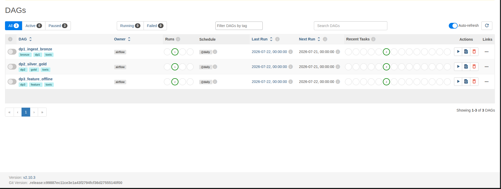
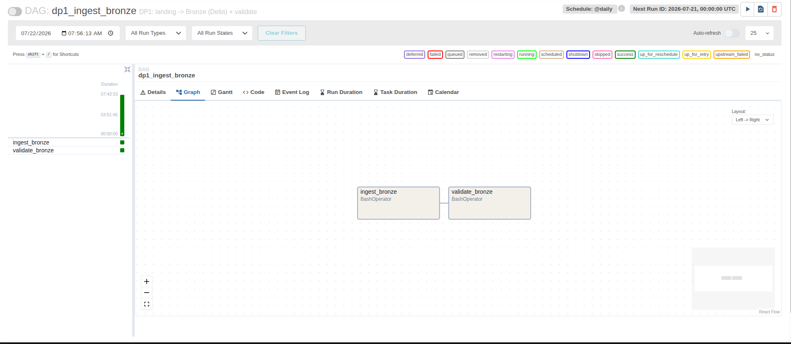
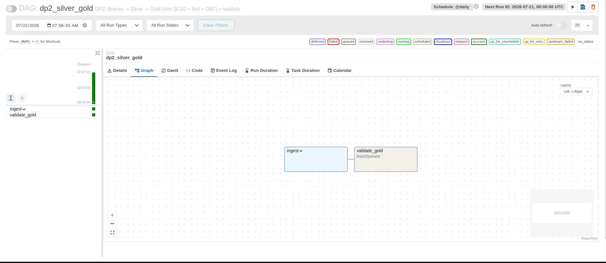
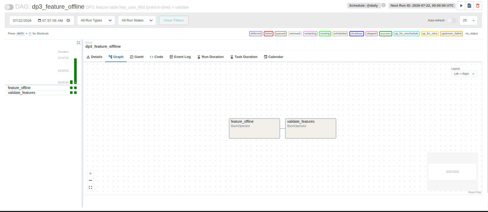
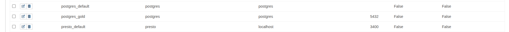
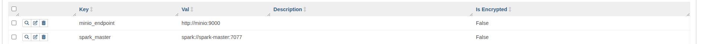

# Orchestration — Airflow (Phase 9 / DP1-DP2-DP3)

Gói 3 pipeline (DP1/DP2/DP3) thành DAG Airflow, mỗi DAG có **2 stage: ingest → validate**, chạy
theo lịch `@daily`, có retry + backoff. Xem thiết kế ở [project_proposal.md §11](../project_proposal.md).

- DAGs: [`pipelines/airflow/dags/`](../pipelines/airflow/dags/) (`dp1_ingest_bronze.py`,
  `dp2_silver_gold.py`, `dp3_feature_offline.py`, `common.py`)
- Airflow chạy **standalone** (1 container: webserver + scheduler + SQLite), UI cổng 8083.

---

## 1. Ba DAG (mỗi DAG = 1 pipeline, 2 stage)

| DAG | Stage ingest | Stage validate |
|-----|--------------|----------------|
| **dp1_ingest_bronze** | `ingest_bronze` (landing → Bronze Delta) | `validate_bronze` (12/12 check) |
| **dp2_silver_gold** | TaskGroup `ingest`: `silver_transform → gold_dim → gold_fact` | `validate_gold` (referential + SCD2) |
| **dp3_feature_offline** | `feature_offline` (feat_user_90d point-in-time) | `validate_features` (2 timestamp + range) |

`default_args`: `retries=1`, `retry_delay=1 phút`, `retry_exponential_backoff=True` (backoff khi lỗi).

## 2. Airflow trigger job ở container khác thế nào

Airflow (container) điều phối job ở các container khác qua **docker socket** (mount + `group_add`
GID docker) — xem [`common.py`](../pipelines/airflow/dags/common.py):

| Loại task | Cơ chế |
|-----------|--------|
| **Spark job** (ingest_bronze, silver, gold_*, feature_offline, validate_bronze) | `docker exec toeic-spark-master spark-submit ...` |
| **Python validate** (validate_gold, validate_features) | chạy ngay trong Airflow (đã cài deps), nối `postgres:5432` |

## 3. Connections & Variables (config tập trung, không hardcode)

`common.py` lấy config từ Airflow, không hardcode trong DAG:

| Loại | Tên | Giá trị |
|------|-----|---------|
| Connection | `postgres_gold` | postgres:5432 / toeic |
| Variable | `spark_master` | spark://spark-master:7077 |
| Variable | `minio_endpoint` | http://minio:9000 |

```python
spark_master = Variable.get("spark_master")
pg = BaseHook.get_connection("postgres_gold")
```

## 4. Bằng chứng


*3 DAG (dp1/dp2/dp3), Failed 0, các run thành công (xanh), schedule @daily.*


*DP1: ingest_bronze → validate_bronze.*


*DP2: TaskGroup ingest (silver → gold_dim → gold_fact) → validate_gold.*


*DP3: feature_offline → validate_features.*


*Connection `postgres_gold` trong Airflow.*


*Variables `spark_master`, `minio_endpoint` trong Airflow.*

---

## Ghi chú vận hành
- Standalone dùng **SQLite + SequentialExecutor** (chạy 1 task/lần) — phù hợp demo, không dùng
  production (Airflow tự cảnh báo banner). Nếu chạy nhiều DAG song song dễ nghẽn → trigger lần lượt.
- Metadata (DAG history, connections, variables) nằm trong SQLite **trong container**: `docker
  compose stop/start` giữ nguyên; `up --build`/recreate sẽ reset.
