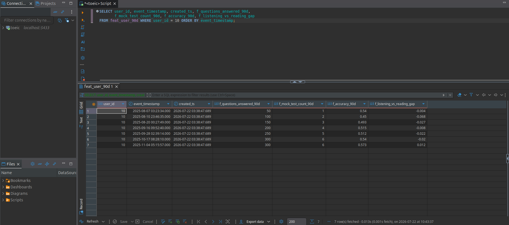
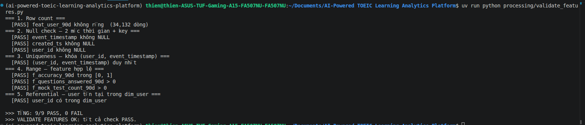
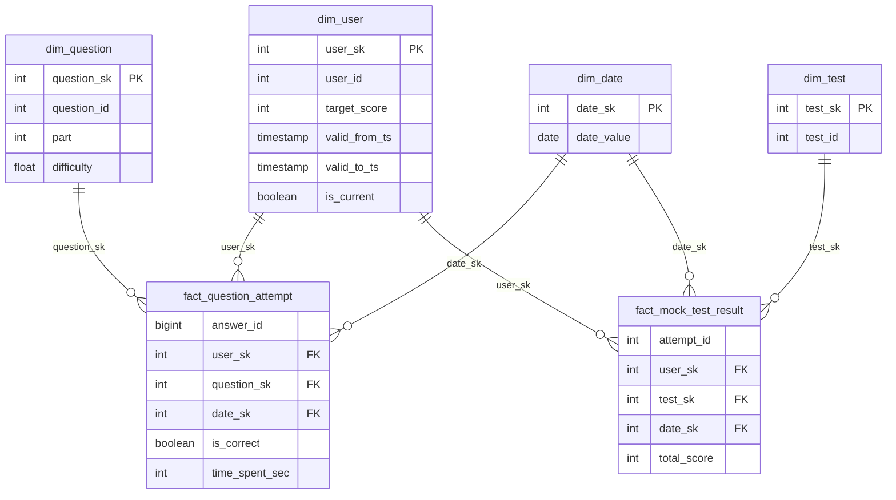
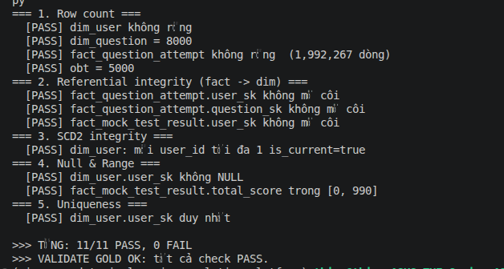
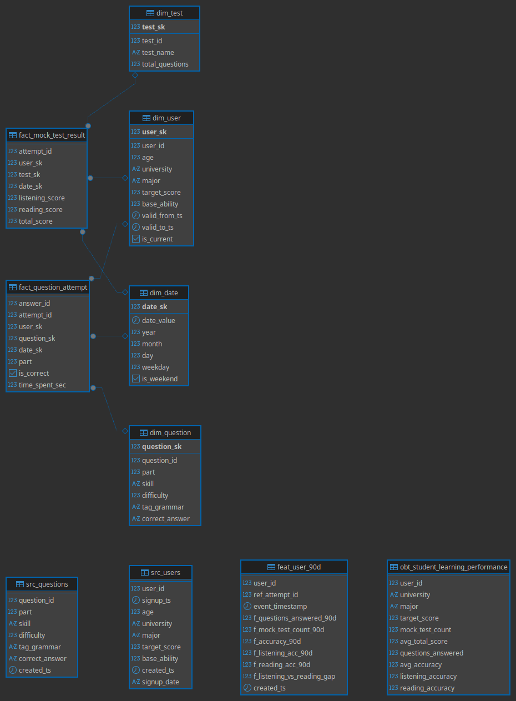
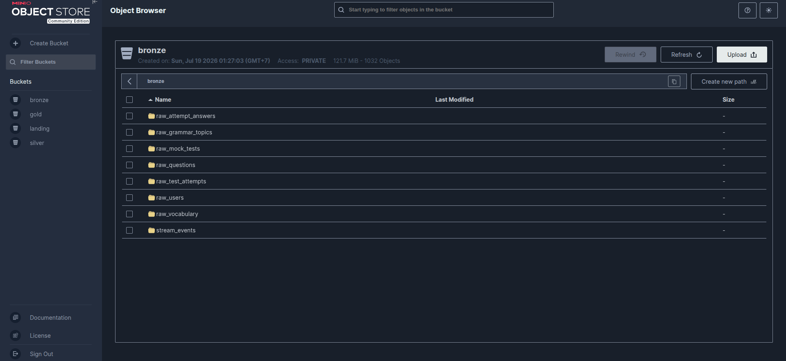
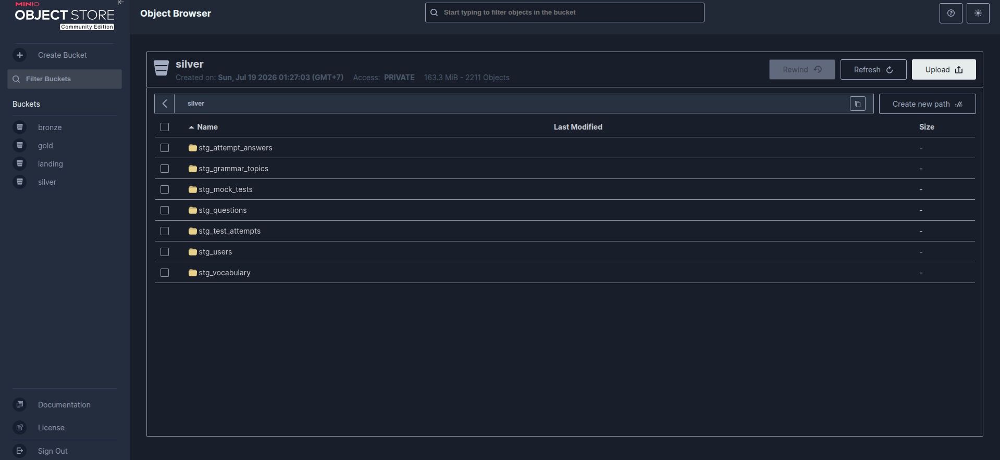
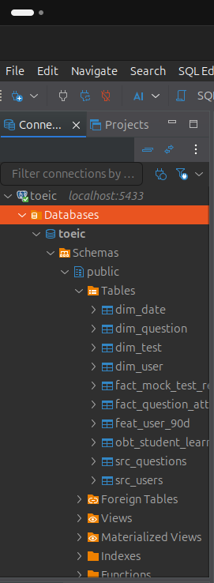
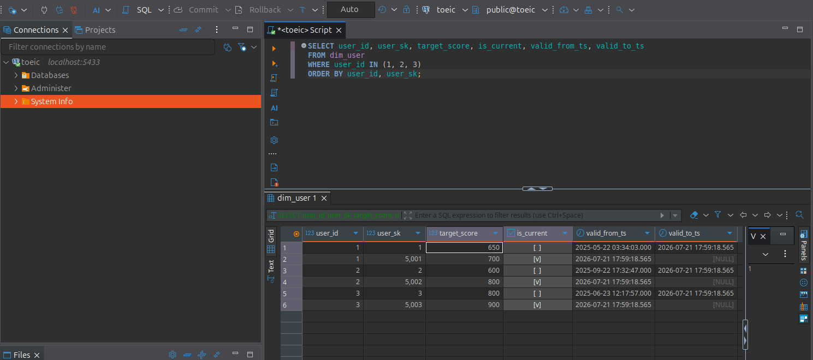

# Schema Design — Bronze / Silver / Gold (Section 02)

Tài liệu thiết kế schema cho lakehouse TOEIC, làm **trước khi** build pipeline Spark
(Phase 5–6).

```
Source (MinIO landing + Postgres) → Bronze (raw_) → Silver (stg_) → Gold (dim_/fact_/obt_/feat_)
```

- **Bronze / Silver** = Delta Lake trên **MinIO**.
- **Gold** = phục vụ BI + ML trên **PostgreSQL**.

---

## 1. Input profile (dữ liệu nguồn từ Phase 2)

| Bảng nguồn | Grain | Key | Volume | Lỗi đã biết |
|-----------|-------|-----|-------:|-------------|
| `users` | 1 học viên | user_id | 5,000 | skew target_score (80% band 600–700) |
| `questions` | 1 câu hỏi | question_id | 8,000 | skew Part 5 (~35%) |
| `vocabulary` | 1 từ | word_id | 3,000 | — |
| `grammar_topics` | 1 chủ đề | grammar_id | 100 | — |
| `mock_tests` | 1 bộ đề | test_id | 30 | — |
| `test_attempts` | 1 lượt thi | attempt_id | ~40,000 | — |
| `attempt_answers` | 1 câu trả lời | answer_id | ~2,040,000 | schema evolution (partition cũ thiếu `difficulty`+`tag_grammar`), duplicate ~2% theo (attempt_id, question_id), high cardinality |

Nguồn tồn tại ở 2 dạng: **file Parquet** (bucket `landing`) và **database** (`src_users`, `src_questions` trong Postgres).

---

## 2. Naming convention

| Prefix | Zone | Ý nghĩa |
|--------|------|---------|
| `raw_` | Bronze | bản sao raw + metadata ingest |
| `stg_` | Silver | đã làm sạch / chuẩn hóa / dedup |
| `dim_` | Gold | bảng chiều (mô tả thực thể) |
| `fact_` | Gold | bảng sự kiện (đo lường được) |
| `obt_` | Gold | One Big Table (denormalized cho dashboard) |
| `feat_` | Gold | feature table cho ML (point-in-time) |

Hậu tố khóa: `_sk` = surrogate key (warehouse tự sinh), `_bk` hoặc tên gốc = business key.

---

## 3. Bronze (`raw_`) — raw y nguyên + metadata

Nguyên tắc: **copy 1:1** từ landing, **KHÔNG sửa lỗi**, chỉ thêm 3 cột metadata.

| Cột metadata thêm vào mọi bảng | Ý nghĩa |
|--------------------------------|---------|
| `ingest_ts` | thời điểm nạp vào Bronze |
| `source` | nguồn (`minio_landing` / `postgres`) |
| `batch_id` | mã lần chạy ingest (idempotency) |

Bảng: `raw_users`, `raw_questions`, `raw_vocabulary`, `raw_grammar_topics`, `raw_mock_tests`,
`raw_test_attempts`, `raw_attempt_answers`.

> Schema evolution: `raw_attempt_answers` đọc bằng Delta `mergeSchema` → partition cũ tự có
> `difficulty`/`tag_grammar` = NULL (chưa điền default ở tầng này).

---

## 4. Silver (`stg_`) — đã làm sạch

Nguyên tắc: từ Bronze → xử lý lỗi → dữ liệu sạch, đáng tin. Vẫn giữ grain chi tiết (chưa mô hình hóa).

| Bảng | Xử lý chính | Dedup key |
|------|-------------|-----------|
| `stg_users` | chuẩn hóa kiểu, loại dòng thiếu key | `user_id` |
| `stg_questions` | chuẩn hóa `part`/`skill` | `question_id` |
| `stg_attempt_answers` | **dedup 2%**, **điền default cho `difficulty`/`tag_grammar` NULL** (schema evolution), ép kiểu | `(attempt_id, question_id)` |
| `stg_test_attempts` | chuẩn hóa timestamp, kiểm tra điểm hợp lệ | `attempt_id` |
| `stg_vocabulary`, `stg_grammar_topics`, `stg_mock_tests` | chuẩn hóa cơ bản | khóa gốc |

---

## 5. Gold — Dimension (`dim_`)

| Bảng | Loại | Key | Cột chính |
|------|------|-----|-----------|
| `dim_user` | **SCD2** | `user_sk` (SK), `user_id` (BK) | age, university, major, target_score, `valid_from_ts`, `valid_to_ts`, `is_current` |
| `dim_question` | SCD1 | `question_sk`, `question_id` | part, skill, difficulty, tag_grammar, correct_answer |
| `dim_test` | SCD1 | `test_sk`, `test_id` | test_name, total_questions |
| `dim_date` | tĩnh | `date_sk`, `date` | year, month, day, weekday, is_weekend |
| `dim_vocabulary` | SCD1 | `vocab_sk`, `word_id` | word, topic, difficulty_level |
| `dim_grammar_topic` | SCD1 | `grammar_sk`, `grammar_id` | topic_name, difficulty_level |

**`dim_user` dùng SCD2** vì `target_score` / `major` có thể thay đổi → cần giữ lịch sử (xem §11).

---

## 6. Gold — Fact (`fact_`)

| Bảng | Grain | Khóa | Measure |
|------|-------|------|---------|
| `fact_question_attempt` | 1 câu trả lời | `answer_id` (degenerate), FK: `user_sk`, `question_sk`, `date_sk` | `is_correct`, `time_spent_sec` |
| `fact_mock_test_result` | 1 lượt thi | `attempt_id`, FK: `user_sk`, `test_sk`, `date_sk` | `listening_score`, `reading_score`, `total_score` |

FK trỏ tới **surrogate key** của dim (không phải business key) — để tương thích SCD2.

---

## 7. Gold — OBT (`obt_`)

`obt_student_learning_performance` — denormalized 1 dòng / học viên, phục vụ dashboard:
`user_id, university, major, target_score, total_attempts, questions_answered,
avg_accuracy, accuracy_part1..7, avg_total_score, last_activity_ts`.

---

## 8. Feature store (`feat_`) — point-in-time

`feat_user_90d` — feature cửa sổ trượt 90 ngày cho ML dự đoán điểm:

| Cột | Ý nghĩa |
|-----|---------|
| `user_id` | khóa thực thể |
| `event_timestamp` | mốc PIT — thời điểm feature có hiệu lực |
| `created_ts` | thời điểm bản ghi được tính (dùng dedup, giữ mới nhất) |
| `f_accuracy_by_part_90d` | độ chính xác theo từng Part trong 90 ngày |
| `f_listening_vs_reading_gap` | chênh lệch listening − reading |
| `f_questions_answered_90d` | số câu đã trả lời 90 ngày |
| `f_mock_test_count_90d` | số lần thi thử 90 ngày |

**Point-in-time rule:** khi join feature với label, chỉ dùng feature có `event_timestamp` **≤**
timestamp của label → tránh data leakage. Rolling 90 ngày phải tính **tại từng mốc thời gian**,
không tính một lần cho toàn lịch sử.

### Thực thi (DP3)

Job [`processing/spark/feature_offline.py`](../processing/spark/feature_offline.py) tính
`feat_user_90d` bằng **range join point-in-time**: mỗi lần thi thử là 1 mốc; tại mỗi mốc tính
đặc trưng rolling 90 ngày với answer có `ans_date < ref_date` (TRƯỚC mốc, không gồm chính nó).
Kết quả **34,132 dòng** (mốc đầu của mỗi user không có 90 ngày lịch sử → bị loại). Validate:
[`processing/validate_features.py`](../processing/validate_features.py) — **9/9 PASS**.

Bằng chứng rolling window (user 10): số câu tăng dần 50 → 100 → … → 300 rồi **ổn định** khi dữ
liệu cũ > 90 ngày rơi khỏi cửa sổ → đúng point-in-time (không dùng dữ liệu tương lai).


*feat_user_90d: mỗi dòng có event_timestamp + created_ts; rolling 90 ngày tại từng mốc thi.*


*DP3 validate stage: 9/9 check PASS (null 2 timestamp, uniqueness, range, referential).*

---

## 9. ERD — quan hệ dim–fact (star schema)



> Trong ERD: `PK` = surrogate key (`*_sk`), `FK` = khóa ngoại trỏ tới surrogate key của dim.
> Các cột id không đánh dấu (`user_id`, `question_id`, `test_id`) là **business key** (xem §2, §5).

---

## 10. Data quality checks

| Loại | Kiểm tra |
|------|----------|
| **Uniqueness** | `user_id` (mỗi is_current 1 dòng) trong `dim_user`; `answer_id` trong `fact_question_attempt`; `(attempt_id, question_id)` sau dedup |
| **Referential** | mọi FK trong fact phải tồn tại trong dim tương ứng (fact → dim) |
| **Null check** | không NULL ở key (`*_sk`, `*_id`) và measure chính (`is_correct`, `total_score`) |
| **Range** | `total_score` ∈ [10, 990]; `difficulty` ∈ [0, 1]; `part` ∈ [1, 7] |
| **SLA** | Gold freshness ≤ 30 phút; feature freshness 5–60 phút |

### Thực thi — validate stage của pipeline

Các check trên được cài đặt thành **validate stage** cho mỗi pipeline (chạy sau ingest, thoát
exit code ≠ 0 nếu FAIL để Airflow bắt lỗi):

| Pipeline | Job validate | Kết quả |
|----------|--------------|---------|
| **DP1** (Bronze) | [`processing/spark/validate_bronze.py`](../processing/spark/validate_bronze.py) | 12/12 PASS ([ảnh](images/phase5/validate-bronze.png)) |
| **DP2** (Gold) | [`processing/validate_gold.py`](../processing/validate_gold.py) | 11/11 PASS (referential + SCD2 integrity) |


*DP2 validate stage: 11/11 check PASS — row count, referential (fact→dim), SCD2 integrity, null/range, uniqueness.*

---

## 11. Chiến lược SCD2 cho `dim_user`

Khi một học viên **đổi** `target_score` (hoặc `major`):
1. **Đóng** dòng hiện tại: set `valid_to_ts = thời điểm đổi`, `is_current = false`.
2. **Mở** dòng mới: `user_sk` mới, giá trị mới, `valid_from_ts = thời điểm đổi`,
   `valid_to_ts = NULL`, `is_current = true`.

→ Giữ được toàn bộ lịch sử thay đổi; fact cũ vẫn trỏ đúng `user_sk` tại thời điểm sự kiện.

**Kiểm tra đúng:** mỗi `user_id` có tối đa **1 dòng** `is_current = true`; các dòng cùng `user_id`
có khoảng `[valid_from_ts, valid_to_ts)` **không chồng lấn**.

---

## 12. Glossary — thuật ngữ

| Thuật ngữ | Giải thích ngắn |
|-----------|-----------------|
| **Grain** | Một dòng trong bảng đại diện cho cái gì (vd 1 câu trả lời, 1 lượt thi). Phải chốt đầu tiên khi thiết kế bảng. |
| **Dimension (dim)** | Bảng mô tả thực thể — trả lời "ai / cái gì" (user, question). Ít dòng, dùng để lọc/nhóm. |
| **Fact** | Bảng ghi sự kiện đo lường được — "xảy ra gì, đo bao nhiêu" (câu trả lời đúng/sai). Nhiều dòng, chứa measure. |
| **Star schema** | Mô hình sao: fact ở giữa, các dim xung quanh. Chuẩn phân tích kinh điển. |
| **Business key (`_bk`)** | ID gốc từ nguồn, có ý nghĩa nghiệp vụ (vd `user_id = 51`). |
| **Surrogate key (`_sk`)** | Khóa nội bộ warehouse tự sinh (vd `user_sk = 1001`), không có ý nghĩa nghiệp vụ. Fact luôn trỏ tới `_sk`. |
| **SCD1** | Slowly Changing Dimension type 1: khi thuộc tính đổi thì **ghi đè**, mất lịch sử. |
| **SCD2** | Type 2: khi đổi thì **mở dòng mới + đóng dòng cũ** (`valid_from_ts`/`valid_to_ts`/`is_current`), giữ lịch sử. |
| **Degenerate dimension** | ID nằm thẳng trong fact, không cần bảng dim riêng (vd `answer_id`). |
| **`dim_date`** | Bảng chiều cho ngày (year/month/weekday/is_weekend) để dễ nhóm theo thời gian. |
| **OBT (One Big Table)** | Bảng phẳng gộp sẵn nhiều bảng, đánh đổi dung lượng lấy tốc độ query (không join). |
| **Feature table (`feat_`)** | Bảng đặc trưng cho ML, có yếu tố thời gian point-in-time. |
| **`event_timestamp`** | Thời điểm feature có hiệu lực (sự kiện xảy ra) — dùng cho point-in-time join. |
| **`created_ts`** | Thời điểm bản ghi được tính ra — dùng để dedup (giữ bản mới nhất). |
| **Point-in-time (PIT)** | Chỉ dùng feature có timestamp ≤ thời điểm label, để tránh data leakage. |
| **Data leakage** | Dùng thông tin từ tương lai để dự đoán → mô hình "gian lận", sai khi chạy thật. |
| **Uniqueness check** | Kiểm tra khóa không trùng (vd `answer_id` duy nhất). |
| **Referential integrity** | FK trong fact phải tồn tại ở dim (không có "sự kiện của thực thể ma"). |
| **Null / Range check** | Key/measure không rỗng; giá trị nằm trong khoảng hợp lệ (vd `total_score` ∈ [10, 990]). |
| **Freshness** | Dữ liệu mới tới mức nào (cách hiện tại bao lâu). |
| **SLA** | Cam kết về chất lượng/độ tươi (vd Gold freshness ≤ 30 phút). |
| **BI (Business Intelligence)** | Biến dữ liệu thô thành biểu đồ/dashboard cho người ra quyết định. Gold phục vụ BI. |
| **Delta Lake** | Định dạng bảng trên data lake có ACID, time travel, hỗ trợ schema thay đổi. |
| **`mergeSchema`** | Đọc nhiều file schema khác nhau → tự gộp schema, cột thiếu = NULL (xử lý schema evolution). |
| **Bronze / Silver / Gold** | 3 tầng dữ liệu: raw → sạch → mô hình hóa (medallion architecture). |

---

## 13. Schema visualization (Phase 11)

Gold có **PK + FK thật** ở DB ([`processing/add_gold_constraints.py`](../processing/add_gold_constraints.py):
4 PK dim + 6 FK fact→dim, 0 orphan) → DBeaver vẽ được ERD quan hệ.


*ERD star schema (DBeaver): fact_question_attempt & fact_mock_test_result → dim_user/dim_question/dim_test/dim_date.*

### Bảng ở cả 3 zone

| Zone | Bằng chứng |
|------|-----------|
| Bronze (Delta/MinIO) |  `raw_*` + `stream_events` |
| Silver (Delta/MinIO) |  `stg_*` |
| Gold (PostgreSQL) |  `dim_*`/`fact_*`/`obt_*`/`feat_*` |

### Điểm nhấn schema
- **SCD2** (`dim_user`):  — mỗi user đổi target có 2 dòng (is_current false/true).
- **Feature point-in-time** (`feat_user_90d`):  — có `event_timestamp` + `created_ts`.
