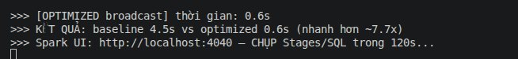
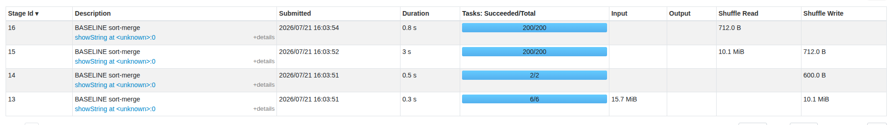
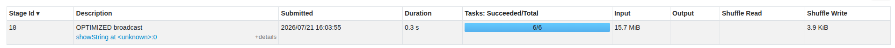
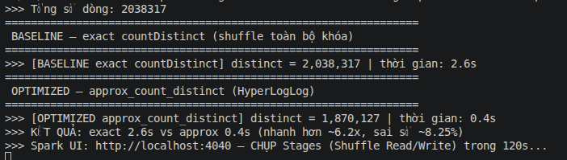
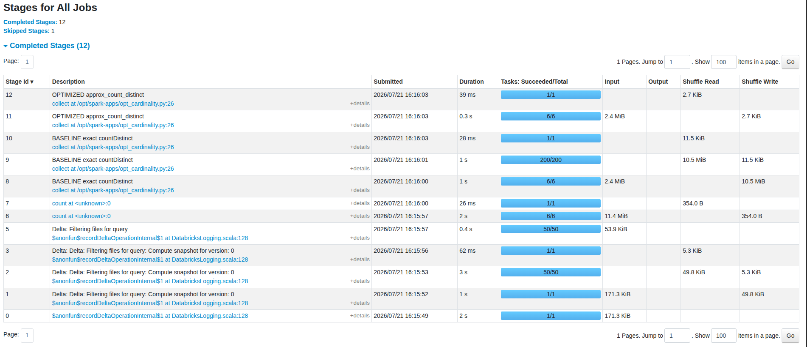
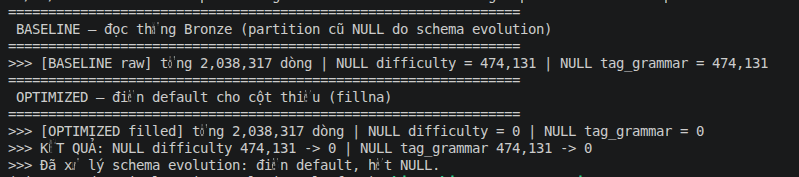
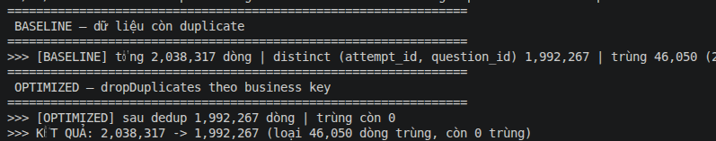

# Spark Optimization — xử lý lỗi offline (Phase 5 / DP1)

Tài liệu ghi quy trình **baseline → quan sát Spark UI → tối ưu → đo lại** cho từng lỗi dữ liệu
offline. Mỗi lỗi trình bày theo format: **Workload → Bottleneck → Optimization → Result → Trade-off**.
Xem thiết kế ở [project_proposal.md §9.1](../project_proposal.md).

- Job ingest raw → Bronze: [`processing/spark/ingest_bronze.py`](../processing/spark/ingest_bronze.py)
- Submit qua wrapper: `bash processing/spark/submit.sh <job.py>`
- Dữ liệu đọc từ Bronze (`s3a://bronze/raw_*`), ~2M dòng `raw_attempt_answers`.

---

## 1. Skew (dữ liệu lệch)

Demo: [`processing/spark/opt_skew.py`](../processing/spark/opt_skew.py)

### Workload
Join bảng lớn `raw_attempt_answers` (~2M dòng) với bảng chiều nhỏ `part_dim` (7 dòng) trên khóa
`part`, rồi tổng hợp theo Part. Khóa `part` **lệch nặng**: Part 5 chiếm ~34% (~690k dòng), các
part khác chỉ ~10%.

### Bottleneck (baseline — sort-merge join)
Ép **sort-merge join** (tắt AQE + tắt broadcast) → Spark **shuffle** cả bảng lớn theo `part`.
Vì chỉ 7 giá trị khóa, dữ liệu dồn vào ít partition; **partition part=5 phình to** → một task ôm
phần lớn dữ liệu trong khi các task khác nhẹ (task lệch).

Bằng chứng Spark UI (`skew-baseline.png`): stage sort-merge có **200 tasks**, **Shuffle Read
10.1 MiB**, thời gian ~3s.

### Optimization (broadcast join)
`part_dim` rất nhỏ → **broadcast** nó tới mọi executor. Bảng lớn **KHÔNG bị shuffle**, mỗi
partition join cục bộ → không còn task lệch.

```python
fact.join(F.broadcast(part_dim), on="part")   # thay vì sort-merge
```

Bằng chứng Spark UI (`skew-optimized.png`): chỉ **6 tasks**, **không có Shuffle Read**
(chỉ 3.9 KiB shuffle write), thời gian ~0.3s.

### Result (before / after)

| Chỉ số | Baseline (sort-merge) | Optimized (broadcast) |
|--------|----------------------:|----------------------:|
| Thời gian join | **4.5 s** | **0.6 s** |
| Số task | 200 | 6 |
| Shuffle Read | 10.1 MiB | ~0 |
| → | **nhanh hơn ~7.7×** | |

### Trade-off
Broadcast chỉ phù hợp khi **bảng được broadcast đủ nhỏ** (nằm vừa RAM executor). Nếu cả 2 bảng
đều lớn thì không broadcast được — khi đó dùng **salting** hoặc **AQE skew join**
(`spark.sql.adaptive.skewJoin.enabled=true`) để chia nhỏ partition lệch.

### Bằng chứng

*Thời gian: baseline 4.5s vs optimized 0.6s (~7.7×).*


*Baseline: sort-merge shuffle 10.1 MiB qua 200 tasks (task part=5 lệch).*


*Optimized: broadcast join, 6 tasks, không shuffle bảng lớn.*

---

## 2. High cardinality (khóa cardinality cao)

Demo: [`processing/spark/opt_cardinality.py`](../processing/spark/opt_cardinality.py)

### Workload
Đếm số giá trị **distinct** của cột `answer_id` — cột có **~2M giá trị duy nhất** (cardinality
gần như tuyệt đối, distinct/tổng = 100%).

### Bottleneck (baseline — exact countDistinct)
`countDistinct(answer_id)` phải **shuffle toàn bộ ~2M khóa** đi khắp cluster để khử trùng rồi
mới đếm. Cardinality càng cao → dữ liệu shuffle càng lớn.

Bằng chứng Spark UI (`cardinality-stages.png`): stage baseline có **Shuffle Write 10.5 MiB**,
một stage **200 tasks**.

### Optimization (approx_count_distinct — HyperLogLog)
`approx_count_distinct(answer_id)` cho mỗi partition dựng một **sketch HLL** nhỏ rồi chỉ gộp các
sketch (vài KiB) → **gần như không shuffle** dữ liệu thật.

```python
df.select(F.approx_count_distinct("answer_id"))   # thay vì F.countDistinct(...)
```

Bằng chứng Spark UI: stage optimized chỉ **Shuffle Write 2.7 KiB**, **6 tasks**.

### Result (before / after)

| Chỉ số | Baseline (exact) | Optimized (approx HLL) |
|--------|-----------------:|-----------------------:|
| Thời gian | **2.6 s** | **0.4 s** |
| Shuffle Write | **10.5 MiB** | **2.7 KiB** (~4000× ít hơn) |
| Số task (stage nặng) | 200 | 6 |
| Kết quả distinct | 2,038,317 (chính xác) | 1,870,127 (~8% lệch) |
| → | **nhanh hơn ~6.2×** | |

### Trade-off
approx đánh đổi **độ chính xác lấy tốc độ + bộ nhớ**: mặc định sai số chuẩn ~5% (lần chạy này
~8%). Có thể giảm sai số bằng cách hạ `rsd` (vd `approx_count_distinct(col, 0.01)` cho ~1%) nhưng
tốn thêm bộ nhớ sketch. Dùng approx khi **con số ước lượng là đủ** (dashboard, giám sát ở quy mô
tỷ dòng); dùng exact khi cần **con số tuyệt đối** (đối soát, tính tiền).

### Bằng chứng

*exact 2.6s vs approx 0.4s (~6.2×), sai số ~8%.*


*Shuffle Write: baseline 10.5 MiB vs optimized 2.7 KiB (~4000× ít hơn).*

## 3. Schema evolution (schema thay đổi theo thời gian)

Demo: [`processing/spark/opt_schema_evolution.py`](../processing/spark/opt_schema_evolution.py)

### Workload
`raw_attempt_answers` được ingest bằng `mergeSchema`. Các partition **trước `2025-09-01`**
(khi generator chưa thêm 2 cột) không có `difficulty` + `tag_grammar` → các dòng đó bị **NULL**.

### Bottleneck (baseline — đọc thẳng)
Đọc thẳng Bronze: **474,131 dòng** (23.3% tổng) có `difficulty` = NULL và `tag_grammar` = NULL.
Nếu tính toán/ML trên cột này mà không xử lý → sai lệch hoặc lỗi.

### Optimization (điền default — fillna)
Điền giá trị default cho cột thiếu:

```python
df.fillna({"difficulty": -1.0, "tag_grammar": "unknown"})
```

`difficulty = -1.0` là giá trị **sentinel** (nằm ngoài dải hợp lệ [0,1] → dễ nhận biết là "thiếu");
`tag_grammar = "unknown"` cho phần phân loại.

### Result (before / after)

| Cột | NULL baseline | NULL sau fillna |
|-----|-------------:|----------------:|
| difficulty | **474,131** | **0** |
| tag_grammar | **474,131** | **0** |

Tổng 2,038,317 dòng — khớp Data Quality Report Phase 2 (partition cũ = 23.3%).

### Trade-off
Điền sentinel (`-1.0`) giữ được đủ dòng nhưng **giá trị là giả** → downstream phải biết `-1.0`
nghĩa là "thiếu", không đưa vào tính trung bình như số thật. Cách khác: giữ NULL và để model xử
lý riêng, hoặc suy ra `difficulty` từ tỷ lệ trả lời đúng (tốn công hơn).

### Bằng chứng

*NULL difficulty/tag_grammar: 474,131 → 0 sau khi điền default.*

## 4. Duplicate (dòng trùng)

Demo: [`processing/spark/opt_duplicate.py`](../processing/spark/opt_duplicate.py)

### Workload
Phase 2 cố tình cài ~2% dòng trùng **business key** `(attempt_id, question_id)` trong
`attempt_answers`. Nếu không khử → thống kê bị đếm đúp (vd tỷ lệ trả lời đúng sai lệch).

### Bottleneck (baseline — còn duplicate)
So tổng dòng với số distinct của khóa `(attempt_id, question_id)`:

| Chỉ số | Giá trị |
|--------|--------:|
| Tổng dòng | 2,038,317 |
| Distinct (attempt_id, question_id) | 1,992,267 |
| **Dòng trùng** | **46,050 (2.26%)** |

### Optimization (dropDuplicates theo business key)
```python
df.dropDuplicates(["attempt_id", "question_id"])
```
Giữ lại 1 dòng cho mỗi cặp `(attempt_id, question_id)`, loại các bản trùng.

### Result (before / after)

| Chỉ số | Baseline | Optimized |
|--------|---------:|----------:|
| Số dòng | 2,038,317 | **1,992,267** |
| Dòng trùng còn lại | 46,050 | **0** |

→ Loại đúng **46,050 dòng trùng**, khớp Data Quality Report Phase 2.

### Trade-off
`dropDuplicates` là **wide transformation** (shuffle theo khóa) → tốn chi phí trên dữ liệu lớn.
Khóa dedup phải chọn đúng **business key** `(attempt_id, question_id)` — nếu dedup theo cả dòng
(mọi cột) thì các bản trùng có `answer_id` khác nhau sẽ **không** bị loại. Ở quy mô lớn, nên dedup
sớm (ngay Silver) để các tầng sau nhẹ hơn.

### Bằng chứng

*Dòng trùng: 46,050 → 0 sau dropDuplicates theo (attempt_id, question_id).*
