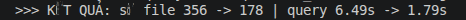
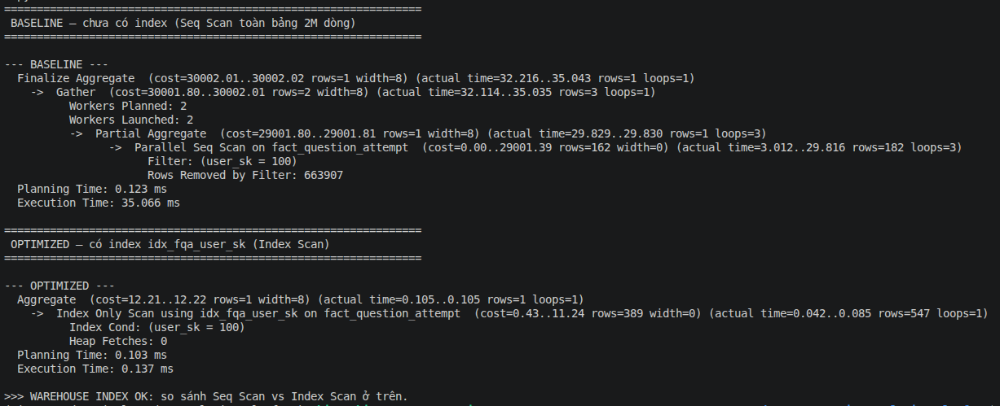

# Storage Optimization (Phase 6.4 / DP2)

Tối ưu lưu trữ ở 2 tầng: **lakehouse** (Delta trên MinIO) và **warehouse** (PostgreSQL Gold).
Mỗi phần theo format: **Workload → Bottleneck → Optimization → Result → Trade-off**.
Xem thiết kế ở [project_proposal.md §10](../project_proposal.md).

---

## 1. Lakehouse — compaction + Z-ORDER (Delta / MinIO)

Job: [`processing/spark/opt_storage_lakehouse.py`](../processing/spark/opt_storage_lakehouse.py)

### Workload
Bảng `stg_attempt_answers` (~2M dòng, partition theo `attempt_date`, 178 partition) thường bị
query lọc theo `question_id`.

### Bottleneck
Ghi Spark tạo **nhiều small files** (mỗi partition ~2 file → tổng **356 file**). Query lọc theo
`question_id` phải mở nhiều file nhỏ + không bỏ qua được file không liên quan (question_id nằm
rải rác) → chậm.

### Optimization
```sql
OPTIMIZE delta.`s3a://silver/stg_attempt_answers` ZORDER BY (question_id)
```
- **OPTIMIZE (compaction):** gom small files trong mỗi partition thành file lớn hơn.
- **Z-ORDER by question_id:** sắp xếp dữ liệu theo `question_id` trong file → min/max mỗi file hẹp
  → Delta **data skipping** bỏ qua file không chứa `question_id` cần tìm.

### Result (before / after)

| Chỉ số | Baseline | Optimized |
|--------|---------:|----------:|
| Số file | **356** | **178** (compaction) |
| Query `WHERE question_id=1234` | **6.49 s** | **1.79 s** (~3.6× nhanh) |

### Trade-off
OPTIMIZE + Z-ORDER **tốn chi phí ghi lại** (rewrite toàn bộ file) → chạy định kỳ, không phải mỗi
lần ghi. Z-ORDER chỉ hiệu quả cho **cột hay lọc/join** (ở đây `question_id`); chọn sai cột thì
không giúp gì. Nên chạy như job bảo trì (compaction ban đêm).

### Bằng chứng

*Số file 356 → 178, query 6.49s → 1.79s sau OPTIMIZE + Z-ORDER.*

---

## 2. Warehouse — index (PostgreSQL Gold)

Script: [`processing/warehouse_index.py`](../processing/warehouse_index.py)

### Workload
`fact_question_attempt` (~2M dòng) hay bị query/join lọc theo `user_sk` (vd lấy câu trả lời của
1 học viên).

### Bottleneck
Không có index → PostgreSQL **Seq Scan** quét toàn bộ 2M dòng, loại phần lớn bằng filter
(`Rows Removed by Filter: 663,907` mỗi worker).

### Optimization
```sql
CREATE INDEX idx_fqa_user_sk ON fact_question_attempt(user_sk);
```
Index B-tree trên `user_sk` → PostgreSQL chuyển sang **Index Only Scan**, chỉ đọc đúng số dòng cần.

### Result (before / after — `EXPLAIN ANALYZE`)

| Chỉ số | Baseline (Seq Scan) | Optimized (Index Scan) |
|--------|--------------------:|-----------------------:|
| Kiểu scan | Parallel Seq Scan | Index Only Scan |
| Execution Time | **35.066 ms** | **0.137 ms** (~256× nhanh) |

### Trade-off
Index **tốn dung lượng** và **làm chậm ghi** (INSERT/UPDATE phải cập nhật index). Chỉ index cột
hay filter/join, không index bừa. Với bảng fact ghi theo lô (batch), chi phí ghi không đáng ngại.

### Bằng chứng

*Seq Scan 35ms → Index Only Scan 0.137ms sau khi tạo index trên user_sk.*
