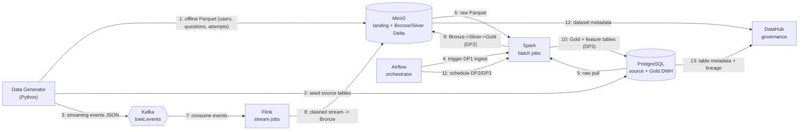

# Project Proposal

## Project Title

AI-Powered TOEIC Learning Analytics Platform

> **Phasing theo coursework:**
> - **Mini-coursework (tài liệu này tập trung vào đây):** Section 01 (Data Generator) + Section 02 (Schema Design & Data Pipelines). **Chấm 100% Data Engineering** — chưa làm ML/LLM.
> - **Final coursework:** Section 03 (Drift + Label) + một AI track (04.1 ML hoặc 04.2 LLM).
>
> Các phần ML/LLM ở cuối tài liệu là định hướng cho final phase, không tính điểm ở mini-coursework.

---

## Table of Contents

1. [Background](#1-background)
2. [Project Objectives](#2-project-objectives)
3. [Scope](#3-scope)
4. [Technology Stack & Deployable Units](#4-technology-stack--deployable-units)
5. [High-Level System Deployment Diagram](#5-high-level-system-deployment-diagram)
6. [Repository Structure](#6-repository-structure)
7. [Section 01 — Data Generator](#7-section-01--data-generator)
8. [Section 02 — Schema, Storage & Pipelines](#8-section-02--schema-storage--pipelines)
9. [Processing Jobs (Spark + Flink)](#9-processing-jobs-spark--flink)
10. [Data Storage Optimization](#10-data-storage-optimization)
11. [Pipeline Orchestration (Airflow)](#11-pipeline-orchestration-airflow)
12. [Data Governance (DataHub)](#12-data-governance-datahub)
13. [Docker & Docker Compose](#13-docker--docker-compose)
14. [Documentation Plan](#14-documentation-plan)
15. [Novel Ideas](#15-novel-ideas)
16. [Final Phase Preview (ML / LLM)](#16-final-phase-preview-ml--llm)
17. [Rubric Coverage Map](#17-rubric-coverage-map)

---

## 1. Background

Nhiều sinh viên cần chứng chỉ TOEIC để tốt nghiệp hoặc ứng tuyển việc làm. Phần lớn nền tảng luyện thi hiện nay chỉ cung cấp tài liệu và đề luyện, chưa khai thác dữ liệu học tập để cá nhân hóa lộ trình.

Sự phát triển của Data Engineering, Machine Learning và LLMs cho phép xây dựng hệ thống học tập thông minh có thể: theo dõi hành vi luyện thi real-time, phân tích điểm mạnh/yếu theo từng Part (1–7), dự đoán điểm TOEIC, phát hiện thay đổi hành vi (drift) quanh kỳ thi, và hỗ trợ giải thích đáp án bằng AI.

Nhóm đề xuất xây dựng **AI-Powered TOEIC Learning Analytics Platform** kết hợp Data Engineering + ML + LLM.

---

## 2. Project Objectives

### Data Engineering (trọng tâm mini-coursework)
* Sinh dữ liệu luyện thi TOEIC ở cả **offline (Parquet)** và **streaming (JSON qua Kafka)**, có inject lỗi dữ liệu thực tế.
* Lưu dữ liệu nguồn vào **MinIO / PostgreSQL** để mô phỏng dữ liệu ở "department khác" cần kéo về Bronze.
* Xử lý lỗi dữ liệu bằng **Spark (offline)** và **Flink (streaming)**, có baseline → optimize và bằng chứng qua Spark UI / Flink UI.
* Xây lakehouse **Bronze → Silver → Gold** (Delta Lake) + **feature store** point-in-time.
* Orchestrate pipeline bằng **Airflow**, theo dõi lineage/data contract bằng **DataHub**.

### Machine Learning (final phase)
* Dự đoán khả năng đạt mục tiêu TOEIC + điểm dự kiến.

### Large Language Model (final phase)
* AI TOEIC Tutor (RAG) + tool call tới Prediction API.

---

## 3. Scope

### In Scope
* **Hoạt động học tập:** học từ vựng, ngữ pháp, luyện câu hỏi, thi thử, xem tài liệu.
* **Data platform:** generator → ingest → lakehouse → warehouse → feature store, có orchestration + governance.
* **Analytics:** tiến độ, độ chính xác theo Part, thời gian học.
* **AI (final):** Score Prediction, Learning Recommendation, AI Tutor.

### Out of Scope
* Thanh toán / quản lý khóa học thương mại.
* Chấm Speaking/Writing bằng AI.
* Tích hợp hệ thống TOEIC chính thức (ETS).
* Full governance/compliance (chỉ làm kiểm soát tối thiểu).

---

## 4. Technology Stack & Deployable Units

| Thành phần | Vai trò | Deployable unit? |
|------------|---------|:---:|
| **Data Generator** (Python) | Sinh offline Parquet + streaming events | ✅ (job/service) |
| **MinIO** | Object storage: source landing + lakehouse Bronze/Silver (Delta) | ✅ |
| **PostgreSQL** | Source DB (mô phỏng department khác) + Gold warehouse cho BI | ✅ |
| **Apache Kafka** | Message broker cho streaming events | ✅ |
| **Apache Spark** | Batch processing lỗi offline + build Gold/feature | ✅ |
| **Apache Flink** | Stream processing lỗi streaming + windowing | ✅ |
| **Apache Airflow** | Orchestration DP1/DP2/DP3, giữ connections & variables | ✅ |
| **DataHub** | Lineage, validation, data contract | ✅ |
| DBeaver | Client xem schema/ERD (chỉ là tool, **không** deploy) | ❌ |

> Lưu ý rubric: mỗi thành phần chính trên diagram phải là **deployable unit**. SDK/CLI/viewer (như Feast SDK, DBeaver) không tính.

---

## 5. High-Level System Deployment Diagram

Mũi tên đi theo **đường truyền dữ liệu**, đánh số thứ tự, mô tả dữ liệu trên mũi tên.



**Hai user flow:**
- **Data flow (số 1–13):** đường truyền dữ liệu chính ở trên.
- **Developer flow:** dev đẩy code → CI build Docker image → `docker compose up` để chạy toàn bộ stack local (xem [§13](#13-docker--docker-compose)).

> Bản vẽ chi tiết (màu mũi tên riêng cho từng flow, chú thích đầy đủ) đặt tại `docs/architecture.md`.

---

## 6. Repository Structure

```
toeic-learning-platform/
├── README.md                  # Tổng quan domain + diagram + link tới docs/
├── docker-compose.yml         # Khởi chạy toàn bộ deployable units
├── pyproject.toml             # Khai báo dependencies (quản lý bằng uv)
├── uv.lock                    # Lockfile khóa version + hash (commit để reproducible)
├── .env.example               # Mẫu biến môi trường (không commit secret)
├── generator/                 # Section 01 - sinh dữ liệu
│   ├── config.yaml            # Tham số generator (seed, skew, burst...)
│   ├── offline_generator.py   # Sinh Parquet + ghi MinIO/PostgreSQL
│   └── stream_generator.py    # Sinh events -> Kafka
├── processing/
│   ├── spark/                 # Spark jobs xử lý offline
│   └── flink/                 # Flink jobs xử lý streaming + windowing
├── pipelines/airflow/dags/    # DP1, DP2, DP3
│   ├── dp1_ingest_bronze.py
│   ├── dp2_silver_gold.py
│   └── dp3_feature_offline.py
├── governance/datahub/        # Recipes ingest lineage + data contract
├── docker/                    # Dockerfile (multistage) cho từng service
├── docs/                      # Tài liệu chi tiết (README chỉ summarize)
│   ├── architecture.md        # Diagram chi tiết + deployable units
│   ├── data_generator.md      # Section 01 write-up + screenshots
│   ├── schema_design.md       # Section 02: SCD2, ERD, naming
│   ├── spark_optimization.md  # Baseline -> optimize + Spark UI
│   ├── flink_streaming.md     # Windowing + Flink UI
│   ├── storage_optimization.md# Compaction/z-order/indexing
│   ├── governance.md          # DataHub lineage + data contract
│   └── novel_ideas.md         # Idea 1, Idea 2 + proof
└── tests/
```

> Mỗi file `.py` có docstring đầu file mô tả nhiệm vụ; mỗi hàm/class có docstring (yêu cầu rubric).

> **Quản lý môi trường Python: dùng `uv`** (thay cho `venv` + `requirements.txt` + `pip`). Dependencies khai báo trong `pyproject.toml`, khóa version bằng `uv.lock`. Cài & chạy:
> ```bash
> uv sync                                       # tạo .venv + cài đúng theo uv.lock
> uv run python generator/offline_generator.py  # chạy trong môi trường đã sync
> ```
> Lý do: nhanh hơn pip nhiều lần và **reproducible** nhờ lockfile (đúng tiêu chí run instructions của coursework). Nếu cần xuất ra pip: `uv export --format requirements-txt > requirements.txt`.

---

## 7. Section 01 — Data Generator

### 7.1 Offline Tables (Parquet → MinIO/PostgreSQL)

| Table | Grain | Key Columns |
|-------|-------|-------------|
| `users` | one per student | user_id, signup_ts, age, university, major, target_score, base_ability, created_ts |
| `questions` | one per question | question_id, part (1–7), skill, difficulty, tag_grammar, correct_answer, created_ts |
| `vocabulary` | one per word | word_id, word, topic, difficulty_level, created_ts |
| `grammar_topics` | one per topic | grammar_id, topic_name, difficulty_level, created_ts |
| `mock_tests` | one per test | test_id, test_name, total_questions, created_ts |
| `test_attempts` | one per attempt | attempt_id, user_id, test_id, start_ts, submit_ts, listening_score, reading_score, total_score |
| `attempt_answers` | one per answer | answer_id, attempt_id, question_id, user_answer, is_correct, time_spent_sec |

**Output & storage:** Parquet partition theo `attempt_date`/`signup_date`, ghi vào **MinIO** (landing) + seed một số bảng vào **PostgreSQL** (mô phỏng dữ liệu department khác cần kéo về Bronze).

**Cơ chế sinh điểm (đơn giản hóa, không cần IRT):** `P(correct) = sigmoid(base_ability − difficulty + noise)`; `base_ability` tăng dần theo thời gian luyện tập để tạo tín hiệu học tập.

### 7.2 Offline Data Problems (rubric: skew/cardinality/schema-evo/dup)
* **Skew:** học viên dồn mục tiêu 600–700; câu **Part 5** chiếm tỷ trọng lớn nhất.
* **High cardinality:** user_id, question_id, attempt_id gần như duy nhất.
* **Schema evolution:** partition cũ (~60% timeline) thiếu `tag_grammar` và `difficulty` (thêm sau `schema_change_date`).
* **Optional problem:** ~2% duplicate trong `attempt_answers` (cùng attempt_id + question_id).

### 7.3 Streaming Events (JSON → Kafka topic `toeic.events`)
Trường chung: `event_id`, `event_type` (lesson_opened|lesson_completed|question_answered|flashcard_reviewed|audio_replay|mock_test_started|mock_test_submitted|login), **`event_timestamp` vs `created_ts`**, `user_id`, `session_id`, `device_type`, `question_id?`, `test_id?`, `part?`, `is_correct?`, `time_spent_sec?`.

### 7.4 Streaming Data Problems (rubric: burst/late/dup)
* **Burst:** baseline ~100 events/phút → spike khung **19:00–22:00** và **2 tuần trước mỗi kỳ thi TOEIC**.
* **Late arrival:** ~12% event có `created_ts` muộn hơn `event_timestamp` (mô phỏng **mobile offline sync**) + **out-of-order**.
* **Optional problem:** ~1.5% duplicate event (cùng `event_id`, trễ 1–3 phút).

### 7.5 Generator Config (ví dụ)
```yaml
n_users: 60000
n_questions: 8000
days_history: 180
random_seed: 42
skew_target_score_band: 0.80      # dồn mục tiêu 600-700
skew_part5_ratio: 0.35
schema_change_date: "2025-09-01"
duplicate_rate_offline: 0.02
base_events_per_min: 100
burst_windows: ["19:00-22:00"]
exam_proximity_burst_days: 14
late_arrival_rate: 0.12
duplicate_rate_stream: 0.015
```

### 7.6 Data Quality Report (bằng chứng — chụp màn hình)
Skew distribution (%), cardinality (approx_count_distinct theo ID), schema evolution (nulls ở partition cũ), duplicate rate trước/sau dedup, streaming burst/late/duplicate rate. **Dedup keys:** offline (attempt_id, question_id); streaming (event_id, giữ `created_ts` mới nhất).

---

## 8. Section 02 — Schema, Storage & Pipelines

```
Source (MinIO/PostgreSQL) → Bronze (raw_) → Silver (stg_) → Gold (dim_/fact_/obt_/feat_) → Feature Store
```
Bronze/Silver = **Delta Lake trên MinIO**; Gold phục vụ BI + ML trên **PostgreSQL**.

### 8.1 Dimension Tables (naming `dim_`)
`dim_user` (**SCD2**: valid_from_ts, valid_to_ts, is_current — vì target_score/major có thể đổi), `dim_question`, `dim_vocabulary`, `dim_grammar_topic`, `dim_date`.

### 8.2 Fact Tables (naming `fact_`)
`fact_question_attempt` (grain: 1 answer; áp dụng dedup 2%), `fact_mock_test_result` (grain: 1 lần thi; listening/reading/total score), `fact_lesson_activity`.

### 8.3 OBT
`obt_student_learning_performance` — denormalized phục vụ dashboard.

### 8.4 Feature Store (point-in-time, naming `feat_`)
Mỗi feature row có **`event_timestamp`** (PIT join) + **`created_ts`** (dedup).
* `feat_user_90d` — `f_accuracy_by_part_90d`, `f_listening_vs_reading_gap`, `f_questions_answered_90d`, `f_mock_test_count_90d`
* `feat_stream_60m` — `f_study_minutes_30m`, `f_audio_replay_rate_30m`, `f_correct_rate_60m`, `f_burst_activity_flag`
* **PIT rule:** không dùng feature có timestamp muộn hơn timestamp của label.

### 8.5 Data Quality & SLA
Uniqueness (attempt_id, answer_id), referential (fact→dim), null check trên key/measure. Gold freshness ≤ 30 phút; feature freshness 5–60 phút.

---

## 9. Processing Jobs (Spark + Flink)

> Rubric yêu cầu: **baseline (chưa optimize) → optimize có giải thích từng step + screenshot Spark UI / Flink UI**, và tích hợp vào Airflow.

### 9.1 Spark — xử lý lỗi offline
| Vấn đề | Hướng xử lý (baseline → optimize) | Bằng chứng |
|--------|-----------------------------------|-----------|
| **Skew** (Part 5 / target band) | Baseline join chậm → salting / broadcast join / AQE skew join | Spark UI: skewed task → cân bằng |
| **High cardinality** | repartition theo key, tránh shuffle thừa | Spark UI: shuffle read/write |
| **Schema evolution** | đọc Delta `mergeSchema`, điền default cho cột thiếu | so sánh null trước/sau |
| **Duplicate 2%** | dedup theo (attempt_id, question_id) | count trước/sau |
| Integration | Spark job được gọi từ Airflow DAG | screenshot Airflow |

### 9.2 Flink — xử lý lỗi streaming + windowing
| Vấn đề | Hướng xử lý | Bằng chứng |
|--------|-------------|-----------|
| **Burst** | backpressure handling, parallelism tuning | Flink UI: throughput/backpressure |
| **Late arrival / out-of-order** | event-time + **watermark** + allowed lateness | Flink UI: late records metric |
| **Duplicate 1.5%** | keyed dedup theo `event_id` trong window | count |
| **Window processing** | tumbling/sliding window tính `f_correct_rate_60m`, burst flag | **đoạn code window** (rubric yêu cầu capture) |

---

## 10. Data Storage Optimization

* **Lakehouse (Delta trên MinIO):** **compaction** gom small files (`OPTIMIZE`), **Z-ORDER** theo `user_id`/`question_id`, **partition** theo `attempt_date`. Đo: số file, kích thước, thời gian query trước/sau.
* **Warehouse (PostgreSQL Gold):** **index** trên cột filter/join thường dùng (`order` theo `event_timestamp`, `user_id`). Đo: runtime + bytes scanned (EXPLAIN ANALYZE) trước/sau.

Viết kết quả theo format: Workload → Bottleneck → Optimization → Result (before/after) → Trade-off. Chi tiết ở `docs/storage_optimization.md`.

---

## 11. Pipeline Orchestration (Airflow)

> Tất cả connections & variables đặt trong Airflow để tái sử dụng giữa các pipeline.

| Pipeline | Mục tiêu | Stages |
|----------|----------|--------|
| **DP1** | Ingest raw → Bronze | ingest stage → **validate stage** |
| **DP2** | Bronze → Silver → Gold | ingest stage → **validate stage** |
| **DP3** | Compute offline feature table (`feat_user_90d`) | ingest stage → **validate stage** |

Bằng chứng: chụp Airflow UI thể hiện các stage và thứ tự trong từng DAG. Mỗi DAG có retry + backoff, run metadata (run_id, row in/out, status).

---

## 12. Data Governance (DataHub)

Với mỗi DP1/DP2/DP3:
* **Lineage** giữa pipeline và các bảng liên quan (Source → Bronze → Silver → Gold → Feature).
* **Data validation + data contract** (schema, uniqueness, null, freshness) gắn vào dataset.

Bằng chứng: chụp DataHub UI thể hiện lineage + validation + data contract. Chi tiết ở `docs/governance.md`.

---

## 13. Docker & Docker Compose

* `docker-compose.yml` khởi chạy toàn bộ deployable units (MinIO, PostgreSQL, Kafka, Spark, Flink, Airflow, DataHub, Generator).
* **Tối ưu Dockerfile:** **multistage build** + base image slim cho service Python (generator/jobs), cài deps bằng **`uv sync --frozen --no-dev`** (cài đúng `uv.lock`, bỏ dev deps, fail nếu lock lệch → reproducible).

```dockerfile
FROM python:3.12-slim AS builder
COPY --from=ghcr.io/astral-sh/uv:latest /uv /usr/local/bin/uv
WORKDIR /app
COPY pyproject.toml uv.lock ./
RUN uv sync --frozen --no-dev          # cài đúng lock, bỏ dev deps

FROM python:3.12-slim
WORKDIR /app
COPY --from=builder /app/.venv /app/.venv
ENV PATH="/app/.venv/bin:$PATH"
COPY . .
```

* **Document image size reduction:** ghi lại image giảm từ **X MB → Y MB** và phương pháp (multistage, `uv` + slim base, loại build/dev deps, `.dockerignore`). Đặt ở `docs/` + README.

> Lưu ý: chỉ áp dụng `uv` cho **service Python tự viết** (generator, jobs đóng gói riêng). Image gốc của Airflow/Spark/Flink giữ cách quản deps riêng của họ (vd Airflow dùng constraints file) — extend image gốc thay vì ép `uv` vào.

---

## 14. Documentation Plan

* `README.md`: tổng quan domain + deployment diagram + Table of Contents, **chỉ summarize** và link tới `docs/`.
* `docs/`: mỗi phần lớn có 1 file riêng (architecture, data_generator, schema_design, spark_optimization, flink_streaming, storage_optimization, governance, novel_ideas).
* **Schema design proof:** ERD quan hệ dim & fact (export DBeaver), bảng `dim_user` có SCD2, bảng `feat_` có `event_timestamp` + `created_ts`, naming convention (`raw_`/`stg_`/`dim_`/`fact_`/`obt_`/`feat_`).
* **Visualize tables on all zones** (Bronze/Silver/Gold) qua DBeaver — chụp màn hình.
* Mỗi screenshot đính kèm trong document có chú thích mục đích (không để ảnh rời cho reviewer tự hiểu).

---

## 15. Novel Ideas

Hai ý tưởng ngoài chương trình EDAI (mỗi ý 5đ — document + proof):

* **Idea 1 — Airbyte** cho ingestion từ PostgreSQL → Bronze thay vì code tay, có connector + schedule (chứng minh chạy được).
* **Idea 2 — Great Expectations** (hoặc `dbt test`) để chuẩn hóa data contract/validation và xuất report HTML, gắn vào Airflow validate stage.

> Có thể thay bằng: Soda Core (DQ), Trino (query Gold), hoặc OpenMetadata. Cần document + bằng chứng chạy thật.
>
> **Bonus:** dùng **`uv`** thay `pip`/`venv` cho toàn bộ dependency management — document được build time & image size giảm bao nhiêu (proof) thì có thể coi là một novel idea bổ sung.

---

## 16. Final Phase Preview (ML / LLM)

> Không tính điểm mini-coursework; giữ ở đây để định hướng kiến trúc.

**Section 03 (Drift + Label):** scenario A *exam-proximity drift* (PSI > 0.15 alert) → `agg_feature_health_daily`, `feature_drift_alerts`; label `will_reach_target_score_30d` (1/0) → `ml_user_label` → join PIT → `ml_user_training`.

**04.1 ML:** dự đoán đạt mục tiêu TOEIC; split time-based; baseline LogReg/Tree; metric PR-AUC; training/serving/retrain + CI/CD.

**04.2 LLM:** AI TOEIC Tutor (RAG trên giải thích đáp án/grammar/script) + **tool call** Prediction API (predicted_score, weak_skill, target_reach_probability); indexing/reindexing có versioning; safety (auth/RBAC, PII masking, injection check).

---

## 17. Rubric Coverage Map

| Hạng mục rubric (mini-coursework) | Điểm | Mục trong tài liệu |
|-----------------------------------|:----:|--------------------|
| README + deployment diagram | 10 | §5, §6, §14 |
| Docker & Docker Compose + optimize | 2 | §13 |
| Data Generator — offline problems (skew/card/schema/dup/config/store) | ~12 | §7.1–7.2, §7.5 |
| Data Generator — streaming problems (burst/late/dup/config) | ~8 | §7.3–7.4 |
| Spark jobs (baseline→optimize, integrate Airflow) | ~12 | §9.1 |
| Flink jobs (burst/late/other + window) | ~10 | §9.2 |
| Data storage optimization (lakehouse + DWH) | 4 | §10 |
| Pipeline orchestration Airflow (DP1/DP2/DP3) | 12 | §11 |
| Data governance DataHub (lineage + contract) | 12 | §12 |
| Documentation (SCD2, feat_, ERD, naming, all zones) | 8 | §8, §14 |
| Novel ideas (×2) | 10 | §15 |
| **Tổng** | **100** | |

---

## Expected Outcomes

Sau mini-coursework: một data platform TOEIC chạy được bằng `docker compose up`, sinh dữ liệu có lỗi thực tế, xử lý bằng Spark/Flink, lưu lakehouse + warehouse tối ưu, orchestrate bằng Airflow, governance bằng DataHub — minh họa đầy đủ vòng đời Data Engineering. Final phase mở rộng sang ML (dự đoán điểm) và LLM (AI Tutor), phù hợp định hướng **AI/Data Engineer**.
